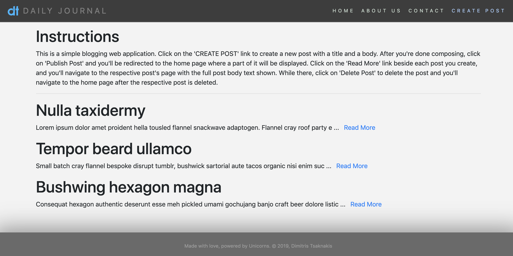
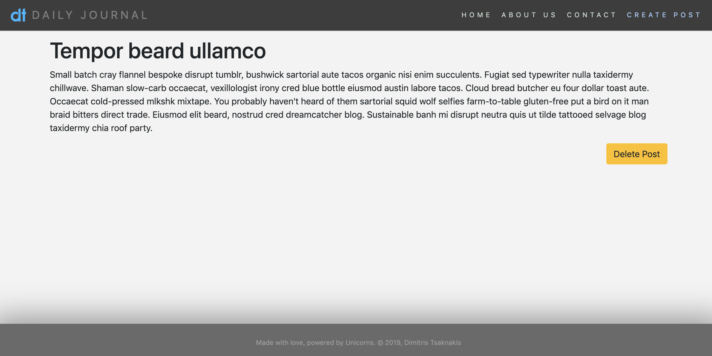

# Simple-Blog-MongoDB version

This is an exercise in [Node.js](https://nodejs.org/en/), [Express.js](https://expressjs.com/), [MongoDB](https://www.mongodb.com/), and [Mongoose](https://mongoosejs.com/). It's a simple blogging web application where one can **add new blog posts**, **view them** in their own dedicated route, and **delete them**. The posts are stored in a local MongoDB database. [EJS templating](https://ejs.co/) is used for the HTML pages, [Bootstrap v4.3](https://getbootstrap.com/docs/4.3/getting-started/introduction/) is also used, along with some custom CSS styling.  
It's basically a backend database upgrade of [this application](https://github.com/dimitristsaknakis/simple-blog-website).  

  

  

It was created by following along the "[The Complete 2019 Web Development Bootcamp](https://www.udemy.com/the-complete-web-development-bootcamp/)" Udemy course, so massive credits and thank yous go there!  

---  

## To run the app:  

### Prerequisites  

In order to run this application locally you'll need to have [Node.js](https://nodejs.org/en/) installed in your system, as well as [MongoDB](https://www.mongodb.com/).  

### Running the app locally  

Once you **clone or download** the repository files to your desired location, open a command-line terminal, navigate into the app top-level directory, and **install the required package dependencies**.   

```bash
$ cd simple-blog-website  # or your chosen other directory name
$ npm install             # install package dependencies
```

Then open two command-line terminals, one to **run the `mongod` process** and the other to **run `mongod`** (so that you can verify the post additions - see below):  

```bash
# CLI tab 1
$ mongod

# CLI tab 2
$ mongo
```

Finally, start the app by running the '[app.js](./app.js)' file:  

```bash
$ node app.js   # or 'nodemon app.js', etc
```

and type "[http://localhost:3000](http://localhost:3000)" in your browser's address to see the application running.  

### Verifying changes via 'mongo'  

Once you've added some posts to the blog (and thus the database), they can be verified by going to the `mongo` CLI tab:  

```bash
> show dbs  # there should be a 'blogDB' present
> use blogDB
> show collections  # there should be a 'posts' collection
> db.posts.find()   # show all post documents in the 'posts' collection

> cls  # clears the screen
> exit # exits the mongo session
```

Don't forget to ***also terminate the 'mongod' process*** via <kbd>Ctrl</kbd>+<kbd>C</kbd> before closing that tab! 

<br>  

---  

Random funny short:  
- "Debugging: being the detective in a crime movie where you're also the murderer".

